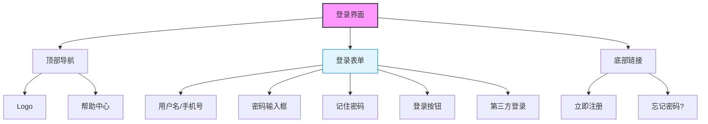

# 登录界面设计

## 设计说明

### 布局结构
- **顶部导航栏**：展示网站Logo和帮助中心链接
- **主体内容区**：登录表单，居中显示
- **底部区域**：注册和忘记密码链接

### 表单元素
1. **用户名/手机号输入框**
   - 支持用户名、手机号、邮箱多种登录方式
   - 带有输入验证提示

2. **密码输入框**
   - 密码可见性切换
   - 强度提示（可选）

3. **记住密码**
   - 复选框形式
   - 默认7天有效

4. **登录按钮**
   - 主色调按钮
   - 悬停效果

5. **第三方登录**
   - 微信、QQ、支付宝图标
   - 一键登录功能

### 交互设计
- 表单验证失焦提示
- 登录按钮loading状态
- 错误信息友好提示
- 自动填充记住的账号