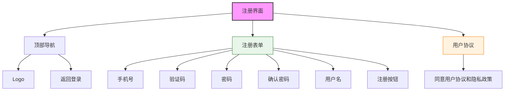

# 注册界面设计

## 设计说明

### 布局结构
- **顶部导航栏**：Logo和返回登录链接
- **主体注册表单**：分步骤填写
- **底部协议**：必须勾选才能注册

### 表单元素
1. **手机号输入**
   - 手机号格式验证
   - 检查是否已注册

2. **验证码**
   - 发送验证码按钮
   - 60秒倒计时
   - 验证码输入框

3. **密码设置**
   - 密码强度提示
   - 密码可见性切换
   - 密码一致性校验

4. **用户名**
   - 可选填写
   - 长度限制

### 交互设计
- 步骤式填写体验
- 实时表单验证
- 手机号实时检查
- 验证码发送限制
- 密码强度检测
- 注册成功后自动登录