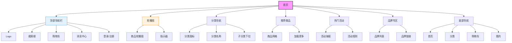

# 首页设计

## 设计说明

### 布局结构
1. **顶部导航栏**
   - Logo品牌标识
   - 搜索框（支持商品搜索）
   - 购物车图标（带数量提示）
   - 消息中心（红点提示）
   - 用户登录状态

2. **轮播图区域**
   - 3-5张商品推广图
   - 自动轮播+手动切换
   - 圆点指示器

3. **分类导航**
   - 9宫格图标布局
   - 悬停显示子分类
   - 快速进入分类页面

4. **推荐商品**
   - 瀑布流/网格布局
   - 商品图片、价格、销量
   - 加入购物车按钮

5. **热门活动**
   - 限时秒杀
   - 新品上市
   - 品牌特卖

6. **底部导航栏**（移动端）
   - 首页、分类、购物车、我的
   - 图标+文字展示

### 交互设计
- 搜索框自动联想
- 购物车商品数量实时更新
- 分类菜单下拉效果
- 商品卡片悬停效果
- 无限滚动加载