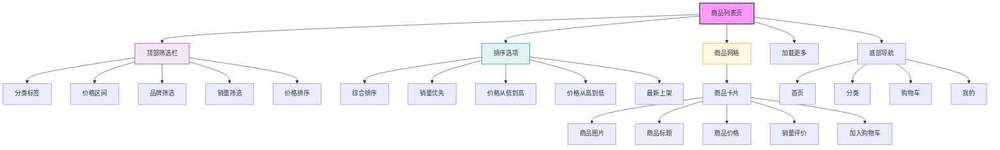

# 商品列表页设计



## 设计说明

### 布局结构
1. **顶部筛选栏**
   - 分类面包屑导航
   - 多条件筛选按钮
   - 筛选结果提示

2. **排序选项栏**
   - 综合排序（默认）
   - 销量优先
   - 价格排序（升序/降序）
   - 最新上架

3. **商品展示区**
   - 网格/瀑布流布局
   - 商品卡片信息完整
   - 支持切换布局模式

4. **底部导航**（移动端）
   - 常用快捷入口

### 商品卡片设计
```
+-----------------------------------+
| [商品图片]                         |
|-----------------------------------|
| 商品标题                          |
| 商品价格    ¥99.99                |
| 销量/评价  月销999+ 好评率99%     |
| [加入购物车] [查看详情]            |
+-----------------------------------+
```

### 交互设计
- 筛选条件可多选组合
- 筛选条件实时生效
- 排序方式即时切换
- 商品卡片点击进入详情
- 滑动到底部自动加载
- 支持收起/展开筛选栏