# 商品详情页设计

```mermaid
graph TD
    A[商品详情页] --> B[顶部导航]
    A --> C[商品图片展示]
    A --> D[商品信息]
    A --> E[SKU选择]
    A --> F[服务保障]
    A --> G[商品详情]
    A --> H[底部操作栏]

    B --> B1[返回按钮]
    B --> B2[分享按钮]
    B --> B3[收藏按钮]

    C --> C1[主图轮播]
    C --> C2[图片预览]
    C --> C3[视频展示]

    D --> D1[商品标题]
    D --> D2[商品价格]
    D --> D3[促销信息]
    D --> D4[优惠券]

    E --> E1[规格选择]
    E --> E2[颜色选择]
    E --> E3[数量选择]
    E --> E4[已选提示]

    F --> F1[正品保证]
    F --> F2[极速发货]
    F --> F3[7天无理由]
    F --> F4[运费保险]

    G --> G1[图文详情]
    G --> G2[规格参数]
    G --> G3[买家评价]

    H --> H1[加入购物车]
    H --> H2[立即购买]

    style A fill:#f9f,stroke:#333,stroke-width:2px
    style C fill:#e1f5fe,stroke:#0288d1,stroke-width:1px
    style D fill:#fff3e0,stroke:#ff6f00,stroke-width:1px
    style E fill:#f3e5f5,stroke:#8e24aa,stroke-width:1px
    style H fill:#e8f5e9,stroke:#388e3c,stroke-width:2px
```

## 设计说明

### 布局结构
1. **顶部导航栏**
   - 返回按钮
   - 分享功能
   - 收藏商品

2. **商品图片展示**
   - 多图轮播（支持手势）
   - 图片放大预览
   - 商品视频展示

3. **商品基本信息**
   - 商品标题
   - 价格信息（原价/现价）
   - 促销标签
   - 优惠券领取

4. **SKU选择区**
   - 规格选择（颜色、尺寸等）
   - 数量增减器
   - 库存实时显示
   - 已选信息汇总

5. **服务保障**
   - 图标+文字展示
   - 增强购买信心

6. **商品详情**
   - 图文详情
   - 规格参数表
   - 用户评价（带评分）

7. **底部操作栏**
   - 加入购物车
   - 立即购买（固定底部）

### 交互设计
- 图片手势滑动
- SKU选择联动价格
- 库存不足提示
- 优惠券一键领取
- 商品详情切换标签
- 滚动时导航栏变化