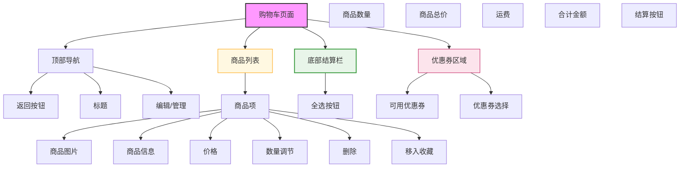

# 购物车页面设计



## 设计说明

### 布局结构
1. **顶部导航栏**
   - 返回按钮
   - 页面标题"购物车"
   - 编辑/管理切换按钮

2. **商品列表区**
   - 商品卡片横向排列
   - 支持多选/全选
   - 可编辑/查看模式切换

3. **优惠券区域**
   - 可用优惠券展示
   - 一键使用优惠券
   - 优惠金额计算

4. **底部结算栏**
   - 固定在底部
   - 全选按钮
   - 商品数量统计
   - 价格明细
   - 结算按钮

### 商品卡片设计（编辑模式）
```
+----------------------------------+
| [☑] [商品图]   [商品名称]        |
|          [价格] x [数量] [🗑]  |
|          [颜色/规格]             |
|          [运费/优惠]             |
|          [移入收藏]              |
+----------------------------------+
```

### 商品卡片设计（查看模式）
```
+----------------------------------+
| [☑] [商品图]   [商品名称]        |
|          [颜色/规格]             |
|          [单价 x 数量 = 小计]     |
|          [优惠信息]              |
+----------------------------------+
```

### 交互设计
- 全选/反选功能
- 数量增减按钮
- 价格实时计算
- 删除确认提示
- 编辑模式切换
- 优惠券自动应用
- 商品失效提示
- 空购物车引导