# 确认订单页面设计

```mermaid
graph TD
    A[确认订单页面] --> B[顶部导航]
    A --> C[收货地址]
    A --> D[商品清单]
    A --> E[支付方式]
    A --> F[发票信息]
    A --> G[订单备注]
    A --> H[价格明细]
    A --> I[提交订单]

    B --> B1[返回按钮]
    B --> B2[标题]
    B --> B3[订单号]

    C --> C1[地址列表]
    C --> C2[新增地址]
    C --> C3[地址管理]

    D --> D1[商品列表]
    D --> D2[商品小计]
    D --> D3[优惠金额]
    D --> D4[运费]

    E --> E1[微信支付]
    E --> E2[支付宝]
    E --> E3[银行卡]
    E --> E4[货到付款]

    F --> F1[发票类型]
    F --> F2[发票抬头]
    F --> F3[税号]

    G --> G1[备注输入框]
    G --> G2[字数限制]

    H --> H1[商品总价]
    H --> H2[运费]
    H --> H3[优惠金额]
    H --> H4[应付金额]

    I --> I1[提交按钮]
    I --> I2[订单须知]

    style A fill:#f9f,stroke:#333,stroke-width:2px
    style C fill:#e8eaf6,stroke:#3949ab,stroke-width:1px
    style D fill:#fff3e0,stroke:#ff8f00,stroke-width:1px
    style E fill:#e0f2f1,stroke:#00796b,stroke-width:1px
    style H fill:#fce4ec,stroke:#c2185b,stroke-width:2px
    style I fill:#e8f5e9,stroke:#388e3c,stroke-width:3px
```



## 设计说明

### 布局结构
1. **顶部导航栏**
   - 返回按钮
   - "确认订单"标题
   - 订单号显示

2. **收货地址**
   - 默认地址高亮
   - 地址管理入口
   - 新增地址按钮

3. **商品清单**
   - 商品图片
   - 商品信息
   - 数量和单价
   - 小计金额

4. **支付方式**
   - 多种支付选项
   - 默认选中常用方式
   - 图标+文字展示

5. **发票信息（可选）**
   - 电子发票/纸质发票
   - 企业/个人发票
   - 税号填写

6. **订单备注**
   - 最多100字
   - 实时字数统计

7. **价格明细**
   - 商品总价
   - 运费说明
   - 优惠金额
   - 最终应付

8. **提交订单**
   - 固定在底部
   - 醒目按钮样式

### 地址卡片设计
```
+----------------------------------+
| 张三 138****5678                |
| 北京市朝阳区xxx街道xxx号         |
| xxx小区x号楼x单元x室            |
| [默认地址] [编辑] [删除]          |
+----------------------------------+
```

### 交互设计
- 地址切换确认
- 支付方式选择
- 价格实时计算
- 表单验证提示
- 提交订单确认
- 订单生成跳转