# 个人中心页面设计

```mermaid
graph TD
    A[个人中心] --> B[顶部信息区]
    A --> C[功能菜单]
    A --> D[订单管理]
    A --> E[常用功能]
    A --> F[底部导航]

    B --> B1[用户头像]
    B --> B2[用户名]
    B --> B3[会员等级]
    B --> B4[编辑资料]

    C --> C1[钱包]
    C --> C2[优惠券]
    C --> C3[积分]
    C --> C4[收藏]
    C --> C5[足迹]
    C --> C6[浏览历史]

    D --> D1[全部订单]
    D --> D2[待付款]
    D --> D3[待发货]
    D --> D4[待收货]
    D --> D5[待评价]
    D --> D6[售后/退换]

    E --> E1[收货地址]
    E --> E2[账号安全]
    E --> E3[消息通知]
    E --> E4[客服中心]
    E --> E5[设置]
    E --> E6[关于我们]

    F --> F1[首页]
    F --> F2[分类]
    F --> F3[购物车]
    F --> F4[我的]

    style A fill:#f9f,stroke:#333,stroke-width:2px
    style B fill:#e8f5e9,stroke:#4caf50,stroke-width:1px
    style C fill:#e3f2fd,stroke:#2196f3,stroke-width:1px
    style D fill:#fff3e0,stroke:#ff9800,stroke-width:1px
    style E fill:#f3e5f5,stroke:#9c27b0,stroke-width:1px
```



## 设计说明

### 布局结构
1. **顶部用户信息区**
   - 头像（可点击更换）
   - 用户名/昵称
   - 会员等级标签
   - 编辑资料入口

2. **我的资产（功能菜单）**
   - 钱包余额
   - 优惠券数量
   - 积分显示
   - 收藏/足迹/历史
   - 图标+数字展示

3. **订单管理**
   - 订单状态分类
   - 各状态订单数量
   - 查看全部订单入口
   - 跳转到订单列表

4. **常用功能**
   - 收货地址管理
   - 账号安全设置
   - 消息通知中心
   - 客服在线帮助
   - 系统设置
   - 关于应用信息

5. **底部导航**（移动端）
   - 快速切换主页面

### 订单状态展示
```
+-----------------------------+
| [全部] [待付款] 1 [待发货] 2  |
|                              |
| [待收货] [待评价] [售后/退换]  |
+-----------------------------+
```

### 功能菜单设计（2x3网格）
```
+-----------+-----------+
| 钱包      | 优惠券    |
| ¥0.00     | 5张       |
+-----------+-----------+
| 积分      | 收藏      |
| 1000分    | 23件      |
+-----------+-----------+
| 足迹      | 历史记录  |
| 15条      | 查看全部  |
+-----------+-----------+
```

### 交互设计
- 个人信息编辑弹窗
- 订单状态快速筛选
- 功能点击跳转相应页面
- 红点提示未读消息
- 下拉刷新功能
- 滑动切换订单状态