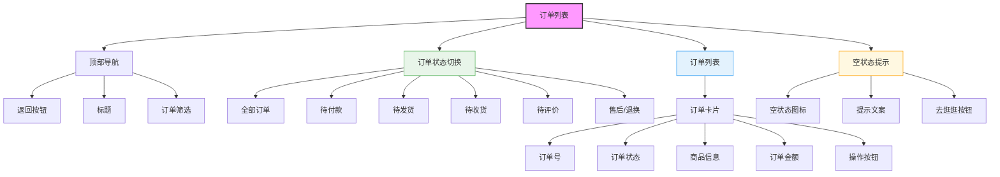

# 订单列表页面设计



## 设计说明

### 布局结构
1. **顶部导航栏**
   - 返回按钮
   - "我的订单"标题
   - 订单筛选入口

2. **订单状态切换栏**
   - 全部订单
   - 待付款
   - 待发货
   - 待收货
   - 待评价
   - 售后/退换

3. **订单列表**
   - 订单卡片纵向排列
   - 支持下拉刷新
   - 上拉加载更多

4. **空状态提示**
   - 无订单时的引导
   - 推荐浏览商品

### 订单卡片设计
```
+------------------------------------------------+
| 订单号：2024012600001    [待付款]              |
| [📱] [📱] [📱]                                |
| 3件商品                         共¥299.00     |
+------------------------------------------------+
| [立即付款] [取消订单]                          |
+------------------------------------------------+
```

### 状态样式说明
- **待付款**：橙色背景，付款按钮突出
- **待发货**：蓝色背景，查看物流
- **待收货**：绿色背景，确认收货
- **待评价**：紫色背景，去评价
- **已完成**：灰色背景，再次购买
- **售后中**：红色背景，查看进度

### 交互设计
- Tab切换订单状态
- 点击订单查看详情
- 操作按钮状态管理
- 订单删除确认
- 付款倒计时提示
- 物流状态实时更新
- 批量操作功能