# 订单详情页面设计

```mermaid
graph TD
    A[订单详情页] --> B[顶部导航]
    A --> C[订单状态]
    A --> D[订单信息]
    A --> E[商品清单]
    A --> F[物流信息]
    A --> G[价格明细]
    A --> H[操作按钮]

    B --> B1[返回按钮]
    B --> B2[订单标题]
    B --> B3[订单号]

    C --> C1[当前状态]
    C --> C2[状态说明]
    C --> C3[进度条]

    D --> D1[订单编号]
    D --> D2[下单时间]
    D --> D3[支付方式]
    D --> D4[收货地址]

    E --> E1[商品列表]
    E --> E2[商品总价]
    E --> E3[优惠信息]

    F --> F1[物流状态]
    F --> F2[物流轨迹]
    F --> F3[物流公司]

    G --> G1[商品金额]
    G --> G2[运费]
    G --> G3[优惠金额]
    G --> G4[实付金额]

    H --> H1[付款]
    H --> H2[查看物流]
    H --> H3[确认收货]
    H --> H4[申请售后]
    H --> H5[删除订单]
    H --> H6[再来一单]

    style A fill:#f9f,stroke:#333,stroke-width:2px
    style C fill:#e3f2fd,stroke:#2196f3,stroke-width:2px
    style E fill:#fff3e0,stroke:#ff9800,stroke-width:1px
    style F fill:#e8f5e9,stroke:#4caf50,stroke-width:1px
    style G fill:#fce4ec,stroke:#e91e63,stroke-width:1px
    style H fill:#f3e5f5,stroke:#9c27b0,stroke-width:1px
```



## 设计说明

### 布局结构
1. **顶部导航栏**
   - 返回按钮
   - "订单详情"标题
   - 订单号显示

2. **订单状态区**
   - 大状态标签
   - 状态说明文字
   - 进度条展示

3. **订单基本信息**
   - 订单编号
   - 下单时间
   - 支付方式
   - 收货地址

4. **商品清单**
   - 商品缩略图
   - 商品名称和规格
   - 数量和单价
   - 小计金额

5. **物流信息**
   - 物流状态
   - 物流轨迹时间线
   - 物流公司信息

6. **价格明细**
   - 商品总价
   - 运费详情
   - 优惠金额
   - 实付金额

7. **操作按钮区**
   - 根据订单状态显示不同按钮

### 不同状态的操作按钮
- **待付款**：立即付款、取消订单
- **待发货**：查看物流、取消订单
- **待收货**：查看物流、确认收货、申请售后
- **待评价**：去评价、再次购买
- **已完成**：再次购买、删除订单
- **已取消**：再次购买、删除订单

### 物流时间线设计
```
+----------------------------------+
| 2024-01-26 14:30                  |
| 【北京】快件已签收                |
+----------------------------------+
| 2024-01-26 10:15                  |
| 【北京】快件已到达北京转运中心    |
+----------------------------------+
| 2024-01-26 08:00                  |
| 【上海】快件已发出                |
+----------------------------------+
| 2024-01-25 20:00                  |
| 【上海】商家已发货                |
+----------------------------------+
```

### 交互设计
- 状态自动更新
- 物流信息实时刷新
- 按钮状态管理
- 订单分享功能
- 售后申请流程
- 评价跳转页面