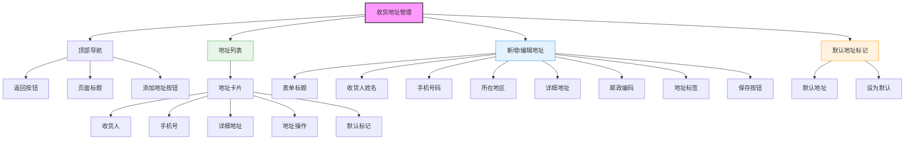

# 收货地址管理页面设计



## 设计说明

### 布局结构
1. **顶部导航栏**
   - 返回按钮
   - "收货地址"标题
   - 添加地址按钮（+号）

2. **地址列表区**
   - 多个地址卡片
   - 默认地址高亮显示
   - 支持排序功能

3. **地址编辑表单**
   - 新增地址弹窗
   - 编辑地址功能
   - 表单验证提示

4. **默认地址管理**
   - 只能有一个默认地址
   - 切换默认地址提示

### 地址卡片设计
```
+--------------------------------------------------+
| [📍] 张三 138****5678                             |
| 北京市朝阳区xxx街道xxx路xxx号                    |
| xxx小区x号楼x单元x室 (朝阳区)                     |
| [默认地址] [编辑] [删除] [设为默认]               |
+--------------------------------------------------+
```

### 地址编辑表单设计
```
+--------------------------------------------------+
| 收货人姓名：______________ [必填]                 |
| 手机号码：  ______________ [必填]                 |
|                                                     |
| 所在地区：  省/市/区 [选择]                         |
| 详细地址：  ______________ [必填]                 |
| 邮政编码：  ______________ [选填]                  |
|                                                     |
| 地址标签：  [家] [公司] [学校] [其他]              |
|                                                     |
|                    [保存] [取消]                  |
+--------------------------------------------------+
```

### 交互设计
- 点击添加新地址
- 长按地址排序
- 表单实时验证
- 删除地址确认
- 默认地址切换
- 地址选择回调
- 地图选点（可选）
- 保存成功提示