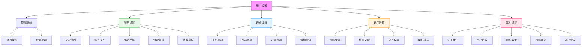

# 用户设置页面设计



## 设计说明

### 布局结构
1. **顶部导航栏**
   - 返回按钮
   - "设置"标题

2. **账号设置组**
   - 个人资料编辑
   - 账号安全中心
   - 手机号绑定管理
   - 邮箱绑定管理
   - 密码修改功能

3. **通知设置组**
   - 系统通知开关
   - 推送通知权限
   - 订单状态通知
   - 营销活动通知

4. **通用设置组**
   - 缓存清理工具
   - 版本更新检查
   - 语言切换选项
   - 夜间模式切换

5. **其他设置组**
   - 应用信息查看
   - 协议文件查看
   - 隐私政策查看
   - 数据清除功能
   - 安全退出登录

### 设置项设计
```
+----------------------------------+
| 个人资料 >                         |
| 账号安全 >                         |
| 修改密码 >                         |
| 绑定手机 138****5678 [解绑]      |
| 绑定邮箱 未绑定 [绑定]            |
+----------------------------------+
| 系统通知 ☐                        |
| 订单通知 ☑                        |
| 营销通知 ☐                        |
+----------------------------------+
| 夜间模式 ☐                        |
| 检查更新 v1.0.0                   |
+----------------------------------+
| 关于我们 >                         |
| 用户协议 >                         |
| 退出登录 [退出]                    |
+----------------------------------+
```

### 交互设计
- 设置项点击跳转
- 开关切换动画效果
- 修改后的保存确认
- 退出登录二次确认
- 版本更新提示
- 缓存清理进度
- 语言切换重载
- 夜间模式平滑过渡