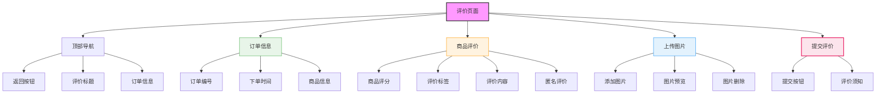

# 评价页面设计



## 设计说明

### 布局结构
1. **顶部导航栏**
   - 返回按钮
   - "评价订单"标题
   - 订单编号显示

2. **订单信息展示**
   - 订单编号
   - 下单时间
   - 评价商品列表

3. **商品评价区**
   - 五星评分组件
   - 评价标签选择
   - 评价文本输入
   - 匿名评价选项

4. **图片上传区**
   - 添加图片按钮
   - 图片预览网格
   - 图片删除功能

5. **提交评价区**
   - 提交按钮
   - 评价须知提示

### 评分组件设计
```
+----------------------------------+
| 请对此商品进行评价                |
|                                  |
| ★★★★★                             |
|                                  |
| [质量很好] [物流很快] [服务满意]  |
|                                  |
| [添加标签]                       |
+----------------------------------+
```

### 评价标签设计
```
+----------------------------------+
| [质量很好] [物流很快]            |
| [包装精美] [服务满意]            |
| [性价比高] [功能强大]            |
| [款式新颖] [尺码合适]            |
| [颜色正] [做工精细]              |
| + 自定义标签                      |
+----------------------------------+
```

### 图片上传设计
```
+----------------------------------+
| + [添加图片]                     |
|                                  |
| [图片1] [图片2] [图片3] [图片4]    |
| [✕]  [✕]  [✕]  [✕]              |
+----------------------------------+
| 最多上传9张图片                  |
| 单张图片不超过5MB                |
+----------------------------------+
```

### 评价须知
- 评价内容文明友善
- 不得包含敏感信息
- 图片需真实拍摄
- 评价后可修改

### 交互设计
- 星级点击评分
- 标签多选效果
- 文字字数统计
- 图片上传限制
- 提交成功提示
- 评价成功跳转