# 搜索页面设计

```mermaid
graph TD
    A[搜索页面] --> B[顶部搜索栏]
    A --> C[搜索历史]
    A --> D[热门搜索]
    A --> E[搜索建议]
    A --> F[搜索结果]
    A --> G[搜索筛选]

    B --> B1[返回按钮]
    B --> B2[搜索输入框]
    B --> B3[搜索按钮]
    B --> B4[清空按钮]

    C --> C1[历史标题]
    C --> C2[历史列表]
    C --> C3[清空历史]

    D --> D1[热门标题]
    D --> D2[热门词云]
    D --> D3[热搜榜]

    E --> E1[搜索建议]
    E --> E2[搜索历史]
    E --> E3[热门搜索]

    F --> F1[结果统计]
    F --> F2[排序选项]
    F --> F3[商品列表]
    F --> F4[加载更多]

    G --> G1[分类筛选]
    G --> G2[价格筛选]
    G --> G3[品牌筛选]

    style A fill:#f9f,stroke:#333,stroke-width:2px
    style B fill:#e3f2fd,stroke:#1976d2,stroke-width:2px
    style C fill:#f5f5f5,stroke:#9e9e9e,stroke-width:1px
    style D fill:#fff3e0,stroke:#ff8f00,stroke-width:1px
    style E fill:#e8f5e9,stroke:#388e3c,stroke-width:1px
    style F fill:#fce4ec,stroke:#c2185b,stroke-width:1px
    style G fill:#f3e5f5,stroke:#7b1fa2,stroke-width:1px
```



## 设计说明

### 布局结构
1. **顶部搜索栏**
   - 返回按钮
   - 搜索输入框
   - 清空按钮
   - 搜索按钮

2. **搜索历史区**
   - "搜索历史"标题
   - 历史记录列表
   - 清空历史按钮

3. **热门搜索区**
   - "热门搜索"标题
   - 热门词汇展示
   - 热搜排行

4. **搜索建议区**
   - 实时搜索建议
   - 搜索历史联想
   - 热门搜索推荐

5. **搜索结果区**
   - 结果数量统计
   - 排序选项
   - 商品列表展示
   - 加载更多功能

6. **搜索筛选区**
   - 分类筛选
   - 价格区间
   - 品牌筛选

### 热门搜索设计
```
+----------------------------------+
| 热门搜索                          |
|                                  |
| iPhone 14 🔥🔥🔥🔥🔥              |
| 运动鞋 🥈                          |
| 口罩 🥉                          |
| 空调 🏅                           |
| T恤 🏆                            |
| 保温杯 🎯                          |
+----------------------------------+
```

### 搜索历史设计
```
+----------------------------------+
| 搜索历史                          |
|                                  |
| [苹果手机] [删除]                |
| [运动鞋] [删除]                  |
| [笔记本电脑] [删除]              |
| [蓝牙耳机] [删除]                |
|                                  |
| [清空历史]                        |
+----------------------------------+
```

### 搜索结果排序选项
```
+----------------------------------+
| 综合 ▼ 销量 价格 ⬆ 评价          |
+----------------------------------+
```

### 搜索筛选栏
```
+----------------------------------+
| 分类 ▼ 价格 [0-100] [100-500] ... 品牌筛选 |
+----------------------------------+
```

### 交互设计
- 实时搜索联想
- 搜索历史记录
- 热门搜索点击
- 搜索结果分页
- 筛选条件组合
- 价格范围滑块
- 搜索关键词高亮
- 无结果提示