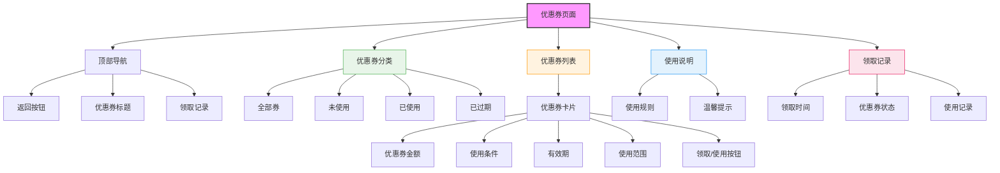

# 优惠券页面设计



## 设计说明

### 布局结构
1. **顶部导航栏**
   - 返回按钮
   - "优惠券"标题
   - 领取记录入口

2. **优惠券分类栏**
   - 全部券
   - 未使用
   - 已使用
   - 已过期

3. **优惠券列表**
   - 优惠券卡片展示
   - 支持滑动切换
   - 状态区分明显

4. **使用说明区**
   - 使用规则说明
   - 温馨提示文字

5. **领取记录区**
   - 领取时间显示
   - 优惠券状态
   - 使用详情

### 优惠券卡片设计（未使用）
```
+----------------------------------+
|                                 |
|     ¥50                          |
|                                 |
| 满299元可用                      |
|                                 |
| 有效期至2024-02-28               |
| 通用券                          |
|                                 |
| [立即使用] [查看规则]            |
+----------------------------------+
```

### 优惠券卡片设计（已使用）
```
+----------------------------------+
|                                 |
|     ¥20                          |
|                                 |
| 已使用 - 2024-01-25              |
| 订单号：202401250001             |
|                                 |
| [查看详情]                       |
+----------------------------------+
```

### 优惠券卡片设计（已过期）
```
+----------------------------------+
|                                 |
|     ¥30                          |
|                                 |
| 已过期 - 2024-01-20              |
|                                 |
| [删除]                           |
+----------------------------------+
```

### 领取记录设计
```
+----------------------------------+
| 领取记录                          |
|                                  |
| 2024-01-26 ¥50券 [未使用]        |
| 2024-01-25 ¥20券 [已使用]        |
| 2024-01-20 ¥30券 [已过期]        |
+----------------------------------+
```

### 交互设计
- Tab切换优惠券状态
- 一键领取优惠券
- 优惠券使用提示
- 有效期倒计时显示
- 使用规则弹窗说明
- 批量删除过期券
- 优惠券分享功能
- 使用后自动跳转